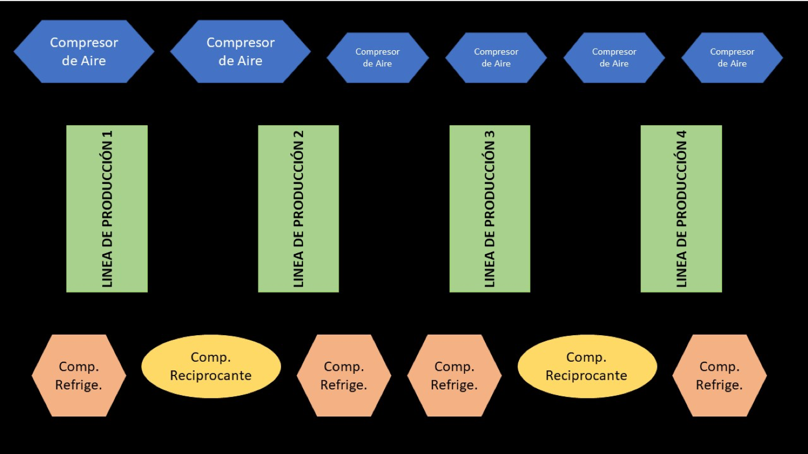

# ENERGY EFFICIENCY
## Refreshing beverages factory “juguitos”
### Suicide Squad - Projecto 1

## PROBLEM STATEMENT 1

* The beverages factory “Juguitos” has a production Schedule that is active 24/7, 365 days a year.

* For this project we will analise data from the first 6 months of the year.

* The factory has 4 production lines, we will attempt to explain how does the volumen produced impacts the energy intake of each line.

## PROBLEM STATEMENT 2

## To supply each production lane with the amount of refrigeration and air compressors needed to produce, the factory has:
* 12 compressorss: 
    
    6 air compressors:
      2 big AC (over 200 HP)
      4 small AC (60 HP)
      
    4 Ammonia compressors 250 HP (refrigeration)

    2 reciprocating compressors 200 HP (displacement/movement)

These compressors feed the 4 production lines.

## The purpose is to determine which combination of compressors presents the lowest energy intake.

## Factory diagram

## There are over 5,700 combinations in which the compressors may be connected to all 4 production lines.

